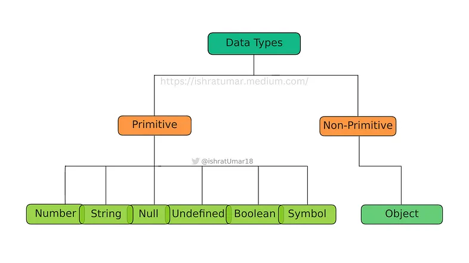
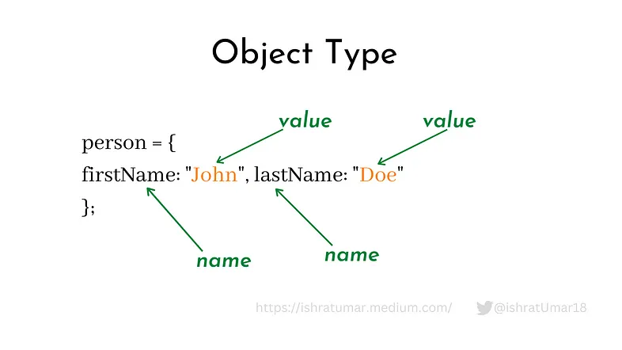

# Data Types

In JavaScript, data types are an important topic. In order to operate on variables, it is important to understand their types. Computers can only safely solve problems with certain types of data types.

Types are the values that variables can have. JavaScript has 7 built-in types of data, which can be broadly categorized as follows:

1. Primitive
2. Non-Primitive



## Data Types in JavaScript


### Primitive type
A primitive type refers to a single value; it can store only one value at a time.

There are 6 types of a primitive type:

1. Number
2. String
3. Boolean
4. Undefined
5. Null
6. Symbol

#### Numbers
Numbers are any numerical values, including whole, fractional, positive, and negative numbers.

Example:
```
let score = 300; // Output: integer value

let marks = 70.5 // Output: decimal number
```

#### Strings
Any group of characters that are enclosed in quotation marks is referred to as strings.

Example:
```
let name= “Ishrat”; // Output: string

let color = "Yellow"; // Output: string
```

#### Booleans
A boolean value can only be either true or false. The digits 0 or 1 are also acceptable. Checking conditions or comparing two variables are its main applications as a logical type.

Example:
```
let a = false;

var isAlive = true;

let x = 6;
let y = 8;
x == y; // return false
``` 

#### Undefined
Although they are declared, undefined variables in data types are variables without a definition, which means they have no value.

Example:
```
let a;
console.log(a); // Output: undefined

let a = 13;
console.log(a); // Output: 13
```

#### Null
Null itself denotes that there is no value.

Example:
```
let a = null; // Output: null
```

#### Symbol

In JavaScript, symbols are a primitive data type that represents a unique, non-string identifier.

Symbols are often used as keys in objects because they are guaranteed to be unique

Here is how you might use symbols in JavaScript:
```
// Declare a symbol called `sym`
const sym = Symbol();

// You can also give your symbol a description for debugging purposes
const symWithDescription = Symbol('A symbol with a description');

// Symbols can be used as keys in objects
const obj = {
  [sym]: 'This value is associated with the sym symbol'
};

// Access the value associated with the symbol using the square bracket notation
console.log(obj[sym]); // Output: 'This value is associated with the sym symbol'
```

## Non-Primitive
The non-primitive type refers to multiple values.

### 1. Object Type

The object type can contain an object, an array, and a date.

An object type in JavaScript is simply a collection of name/key-value pairs in its address.

Example illustration:


#### Creating an object:
Both defining a variable as an object literal and stating that it is equal to newObject() operate in essentially the same ways. But typing out an object literal is faster and simpler.

Let’s create an object literal.
```
var obj = { x: 15, y: 26 };
When we refer to obj, we are actually referring to the memory address that has the value{ x: 15, y: 26 } rather than the actual data itself.
```

See the example below to understand how we can change or modify the object:
```
obj[x] = 17;
console.log(obj) // Output will be {x: 17, y: 26}
The typeof operator
In JavaScript, the typeof operator is unary operator that you can use to find the type of a variable.
```

Example:
```
const num = 42;
console.log(typeof num); // Output: 'number'

const str = 'hello';
console.log(typeof str); // Output: 'string'

const bool = true;
console.log(typeof bool); // Output: 'boolean'

const sym = Symbol();
console.log(typeof sym); // Output: 'symbol'

const obj = {};
console.log(typeof obj); // Output: 'object'

const func = function() {};
console.log(typeof func); // Output: 'function'

const undef = undefined;
console.log(typeof undef); // Output: 'undefined'

const nul = null;
console.log(typeof nul); // Output: 'object' (this is a quirk of JavaScript)
```

Know that the `typeof` operator has some restrictions but can be useful for determining the type of a value. For instance, when the typeof operator is used on both objects and null, it returns the object; similarly, when it is used on both functions and arrow functions, it returns the function.

In some cases, it may be more beneficial to use other methods when looking into a value type.