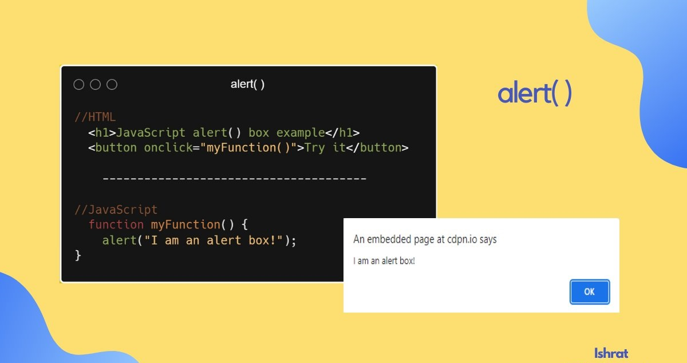
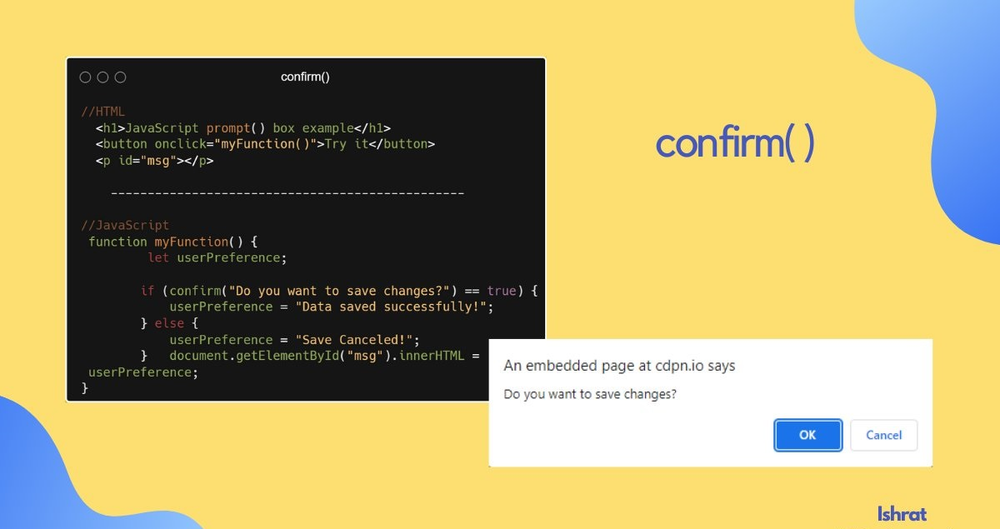
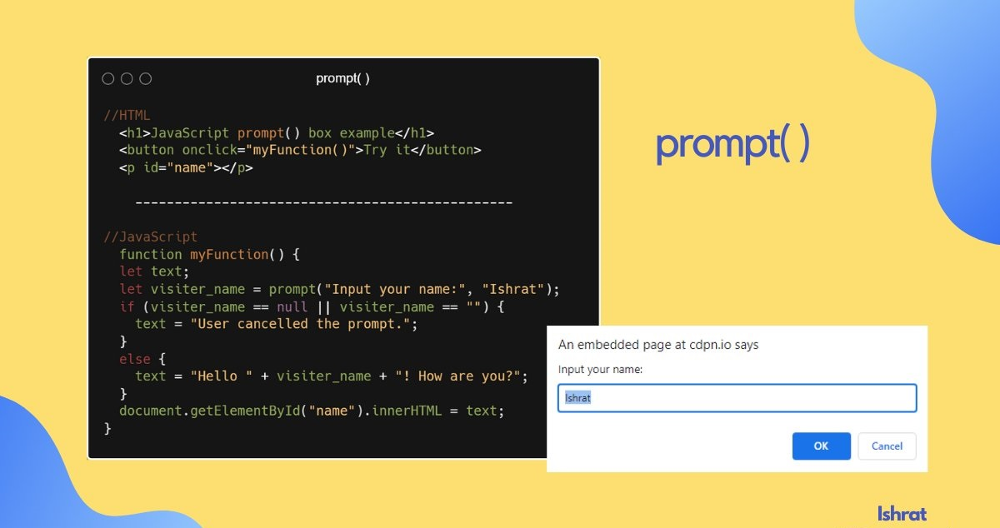

# JavaScript Popup Boxes

To interact with visitors, JavaScript provides 3 kinds of popup boxes:
     
     ❶ alert( )
     ❷ prompt( )
     ❸ confirm( )

## ❶ alert( )

The alert box is the simplest of all the popup boxes; it allows you to display a message with a button to dismiss the alert. In most browsers, the button is labeled as OK. Some browsers let you dismiss it by clicking the close button.

## ❷ confirm( )

It is similar to an alert box, except the user has the option to cancel the message. If you want to get the user's approval or confirmation, you often use a confirmation box.

## ❸ prompt( )

It is similar to confirm boxes, but it additionally has a text input field. It is mostly used when you want the user to enter a value before moving to the next page.

If the user clicks "OK", the value entered in the box is displayed, and if the visitor hits "Cancel" it returns null.

